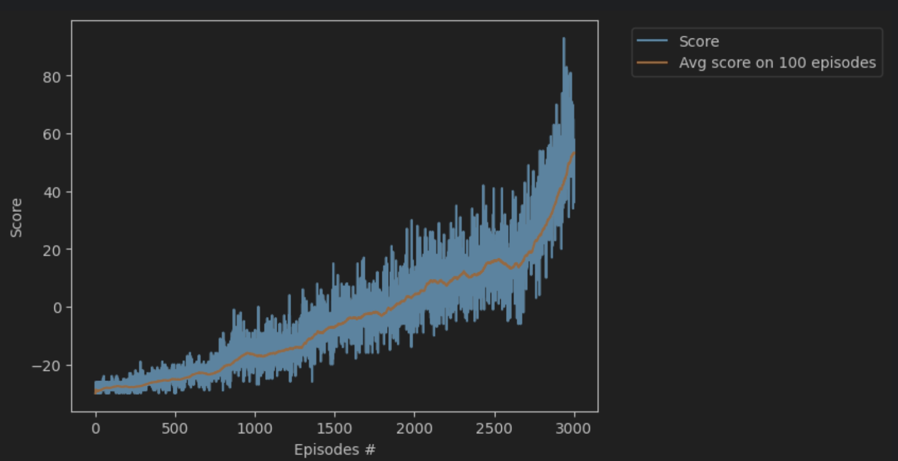
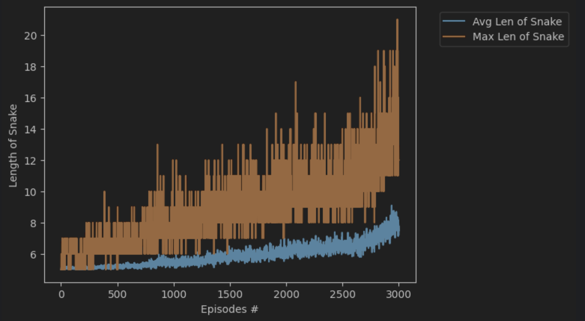

# Neural Network Snake Game

This repository contains a Jupyter notebook that implements the classic Snake game using a neural network model built with PyTorch. The project demonstrates how to apply reinforcement learning techniques to train a model capable of playing Snake autonomously, showcasing the basics of game environment interaction, neural network training, and decision-making processes.

## Table of Contents
- [Project Overview](#project-overview)
- [Installation](#installation)
- [Usage](#usage)
- [Model Architecture](#model-architecture)
- [Training the Model](#training-the-model)
- [Results and Observations](#results-and-observations)
- [Future Work](#future-work)
- [Contributing](#contributing)
- [License](#license)

## Project Overview
The goal of this project is to explore reinforcement learning (RL) by applying it to a simple yet challenging problem: playing the Snake game. It involves creating a neural network that learns to navigate the game environment, avoid obstacles, and maximize the score by collecting food items.

## Installation
To run this notebook, you will need Python 3.x and the following packages:
- `torch`
- `numpy`
- Other dependencies as required by the notebook

You can install the dependencies using pip:
```bash
pip install torch numpy
```

## Usage
After cloning the repository, you can run the notebook using Jupyter Notebook or JupyterLab:
```bash
jupyter notebook Snake.ipynb
# or
jupyter lab Snake.ipynb
```

## Model Architecture
The neural network model, defined in model.py, utilizes a simple yet effective architecture to process the game's state and output the best possible move for the snake. The model's details and architecture will be discussed within the notebook.

## Training the Model
The notebook details the training process, including setting up the game environment, defining the reward system, and iterating through episodes to improve the model's performance.

## Performance Analysis



### Learning Progress Over Episodes

The included performance graph demonstrates the agent's ability to learn and adapt over time through reinforcement learning. The x-axis represents the number of training episodes, while the y-axis displays the score achieved by the agent in each episode.

#### Key Observations from the Graph:

- **Score Trends**: The graph features a dark blue line representing the score for each individual episode, which is quite volatile due to the exploratory nature of the learning process. Meanwhile, the light orange line shows the average score across the last 100 episodes, providing a smoothed trend line that indicates the overall learning progress.

- **Improvement Over Time**: There is a clear and consistent upward trend in the average score, which suggests that the agent is improving its strategy as it learns from its experiences. This is indicative of the agent effectively learning how to navigate the game environment, avoid crashes, and score points by finding food.

- **Variance in Performance**: The shaded blue area around the average score line reflects the variance in the agent's scores across episodes. This variance may stem from the agent's exploration of the game environment or the stochastic elements within the game itself.

- **Training Stability**: The increasing variance in scores suggests that while the agent's average performance is on the rise, there is still significant room for learning and optimization. The absence of a plateau in the trend line implies that the agent has not yet fully converged to an optimal policy.

- **Extensive Training**: The graph displays data for 3,001 episodes, indicating that the agent underwent a substantial amount of training. This volume of training is typical for deep reinforcement learning models, which require extensive interaction with the environment to refine their decision-making policies.

### Length of Snake Analysis



The length of the snake chart demonstrates two key metrics:

- **Average Length of Snake**: Represented by the dark blue line, this metric indicates the average size the snake achieves in each episode. A general upward trend is observed, showing that the agent is consistently able to grow the snake longer over time.
- **Maximum Length of Snake**: The light orange line marks the maximum length achieved in any given episode. This metric is particularly spiky, which may reflect the occasional successful episode where the agent performs exceptionally well.

**Insights**:
- **Learning Effectiveness**: The gradual increase in both average and maximum lengths suggests that the agent is learning effective strategies for avoiding crashes and collecting food.
- **Episode-to-Episode Variability**: The spikes in maximum length, contrasted with the average, indicate that while the agent occasionally reaches high lengths, its performance can vary significantly from episode to episode.
- **Progress Over Time**: The increasing average length of the snake, especially notable in later episodes, suggests that the agent's ability to play the game without crashing improves as it learns.


### Conclusion

The graph is a testament to the agent's learning capabilities, highlighting the success of the implemented reinforcement learning algorithms. As the training progresses, we expect the agent to continue improving and potentially reach a plateau in performance, which would suggest the achievement of an optimal or near-optimal strategy.

